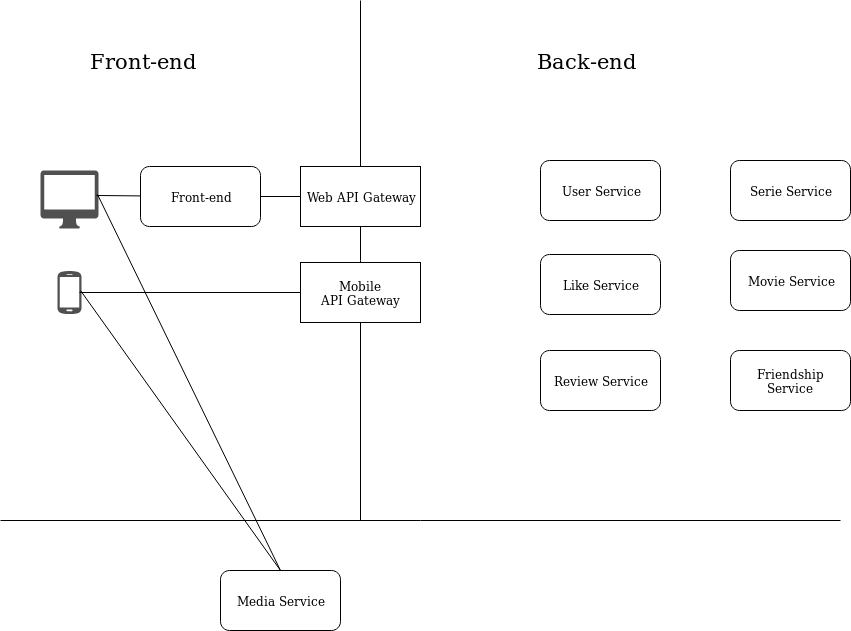

Welcome to the Social Movie Project!
====================================

What is Social Movie?
---------------------

Social Movie is a fictional streaming web-site, where users can watch movies, make reviews and follow others, like a social-network. Imagine Netflix + Facebook + IMDb together!

The propose of this site is to learn technologies like Node Js, Mongo DB, DotNet Core and micro services in general.

This site will never be done completetly. This is not the purpose of it. It will always be incremented and refactored as I learn more languages, tools and concepts.

What do we have so far?
-----------------------

The next diagram is an idea of how this system is going to be structured.

Until now, just the [Front End](front-end.md), [Web Api Gateway](web-api-gateway.md) and User service ([User Api](user-api.md), [User Authentication](user-authentication.md) and [User Authorization](user-authorization.md)) are partly made.
